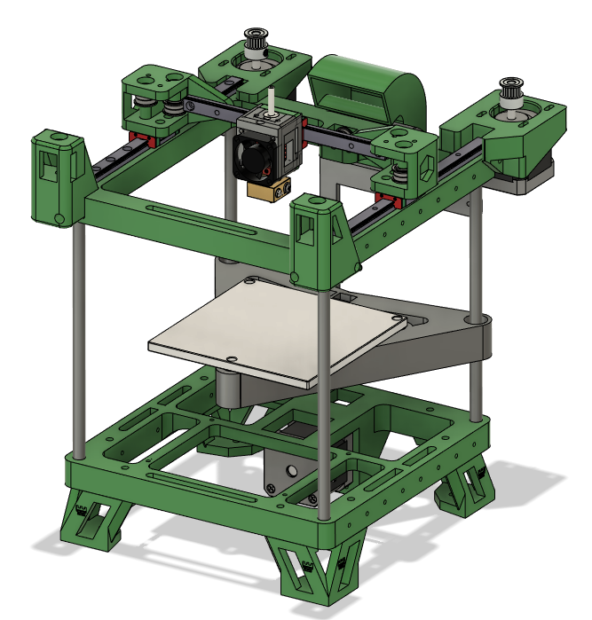

# Rook MK1 Release

### NOTE
### This Github is outdated and should no longer be used, please find the updated Rook parts here
https://www.printables.com/model/387431-rook-mk1-3d-printer

Welcome to the DIY 3D Printer called Rook!

This is a tiny mostly 3d printed CoreXY printer with a build volume of 120x120

The goal of this printer is to make a cheap easy to build 3D printer than can be built by anyone.

## Features:

- 3D Printed Frame
- CoreXY
- Belted Z
- Voron v0 Bed Support
- Only Roughly $260 USD in cost

## Build F.A.Q

- I print with 3 walls and 15 percent infill, if you want stronger go 4 walls 20 percent infill should be plenty
- I use PLA-PRO for the prototype and it worked well, ABS and ASA would be great too
- My Discord server has alot of mods for the Rook check it out
- This printer uses all F695 bearings now no more 20t idlers
- There are slots in the motor mounts to tension the belts

### [Guide on printing Rook parts](https://docs.google.com/document/d/14NUIy8K9r257I05OOpFD31NS8CgYQ1dotUWH_kRIqbQ/edit?usp=sharing)

### [BOM on Google Drive](https://docs.google.com/spreadsheets/d/1oHDEvndkkvPFOBis4atrHRHK_DMTvttFUFWDg2He6To/edit#gid=0)

### [Videos on Youtube](https://www.youtube.com/playlist?list=PLypdl9fsWkKeaa7d5Pv2bP5feIVcw-To2)

### [Support me on Patreon](https://www.patreon.com/rolohaun)
