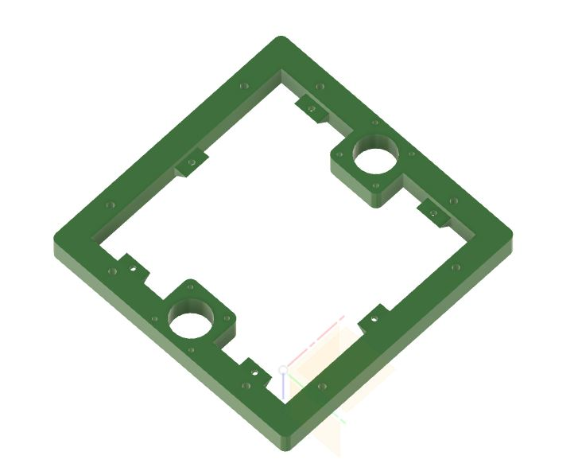
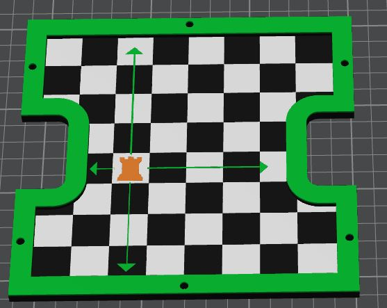
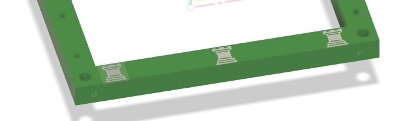

# ROOK - mods by robandwend (Robertg)

## Modifications in the build

### Base Plate

The Base plate is designed to cover up any electronics added under the bed, and give a visual pop.

### Bottom Frame changes
* Minor chamfers added 
* Added small shelves with inset holes to support a Base Plate

### Legs
* Fillet to match the Base Plate above

### Top Plate

Rook Graphic added

